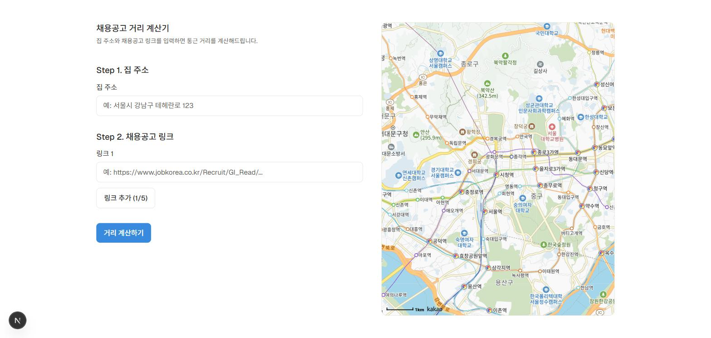
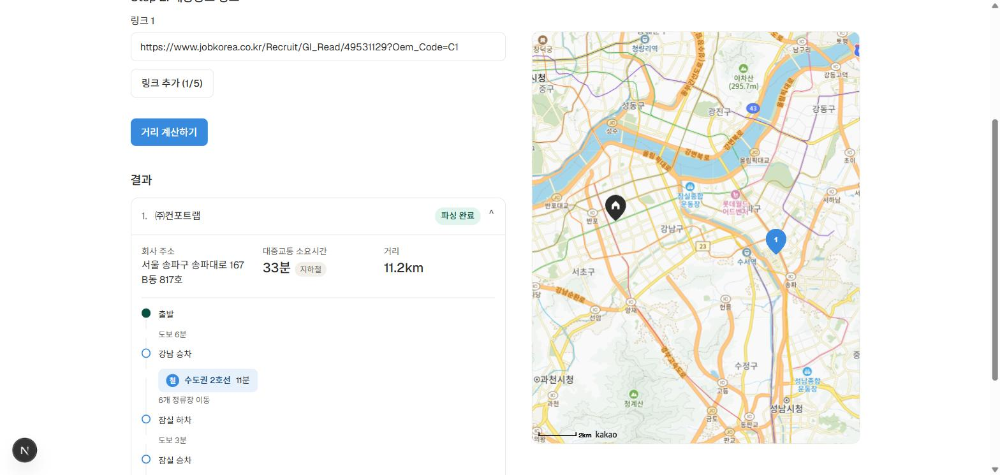

# 채용공고 거리 계산기 (job-distance-calculator)

집 주소와 채용공고 링크(현재 잡코리아, 원티드만 가능)를 붙여넣으면, 회사 위치를 자동으로 찾아 통근 거리·소요시간·대중교통 경로를 계산해주는 서비스입니다.

## 목차

- [프로젝트 설명](#프로젝트-설명)
  - [기능](#기능)
  - [기술 스택과 선택 이유](#기술-스택과-선택-이유)
  - [직면했던 문제들](#직면했던-문제들)
  - [향후 구현할 기능](#향후-구현할-기능)
- [사용법](#사용법)
- [역할](#역할)

## 프로젝트 설명

채용 사이트마다 공고를 열어 회사 주소를 확인하고, 지도 앱에 하나하나 검색해서 통근 거리를 가늠하는 과정은 여러 공고에 동시에 지원할 때 특히 번거롭습니다. 이 프로젝트는 그 과정을 자동화합니다 — 집 주소 한 번, 채용공고 링크 여러 개를 입력하면 나머지는 서버가 처리합니다.

### 기능

- **집 주소 입력**: 최초 1회 입력 후 카카오 로컬 API로 좌표 변환
- **채용공고 링크 다중 입력**: 최대 5개까지 한 번에 추가/삭제
- **회사 주소 자동 파싱**: 잡코리아·원티드는 `schema.org JobPosting` 구조화 데이터(JSON-LD)를 읽어 회사명·주소를 정확하게 추출
- **거리/소요시간 계산**: ODsay 대중교통 API로 전체 경로 후보 중 **최단 시간** 경로를 선택하고, 그 경로의 실제 이동 거리·소요시간·교통수단(지하철/버스/버스+지하철)을 표시
- **경로 상세 타임라인**: 출발 → 도보/승차역 → 노선(호선·버스번호)·소요시간·정류장 수 → 하차역 → 도착까지, 실제 환승 정보를 세로 타임라인으로 시각화
- **지도 시각화**: 카카오맵에 집(하우스 아이콘)과 각 회사 위치(결과 리스트 순번과 동일한 번호 마커) 표시
- **자동 파싱 실패 시 폴백**: 회사명·주소를 직접 입력하는 수동 폼으로 자연스럽게 전환, 이후 동일하게 거리/경로 계산
- **크롤링 캐시**: 동일 URL 재요청 시 실제 크롤링 없이 캐시된 결과 반환, 순차 크롤링(1초 딜레이)으로 상대 서버에 부담을 최소화

### 기술 스택과 선택 이유

| 영역          | 선택                              | 이유                                                                                                                                                                                  |
| ------------- | --------------------------------- | ------------------------------------------------------------------------------------------------------------------------------------------------------------------------------------- |
| 프레임워크    | Next.js (App Router) + React      | 프론트엔드와 API Route(백엔드)를 한 프로젝트에서 함께 다룰 수 있어, 크롤링·외부 API 호출처럼 브라우저에서 직접 하면 안 되는 작업(CORS, API 키 노출)을 서버 쪽에 자연스럽게 둘 수 있음 |
| 언어          | TypeScript                        | 크롤링 결과·외부 API 응답처럼 형태가 자주 바뀌는 데이터를 다루는 프로젝트라, 타입으로 필드 누락을 미리 잡아주는 게 특히 유효했음                                                      |
| 스타일링      | Tailwind CSS v4                   | 디자인 시스템 문서(컬러 토큰·radius·타이포)를 `@theme` 커스텀 프로퍼티로 그대로 옮겨 유틸리티 클래스로 바로 소비 가능                                                                 |
| HTML 파싱     | cheerio                           | 정적 HTML 크롤링에 가벼움. JSON-LD처럼 구조화된 데이터가 있는 사이트는 이것만으로 충분했음                                                                                            |
| 지오코딩/지도 | 카카오 로컬 API + 카카오맵 JS SDK | 국내 주소 체계(도로명/지번) 지원이 가장 안정적이고, REST API와 지도 SDK를 같은 콘솔에서 발급받아 관리 가능                                                                            |
| 대중교통 경로 | ODsay                             | 카카오·네이버 모두 대중교통 길찾기는 공개 API로 제공하지 않음 — 국내에서 대중교통 경로/소요시간을 공개 API로 제공하는 사실상 유일한 선택지                                            |

### 직면했던 문제들

- **채용 사이트별 파싱 가능 여부가 완전히 다름**: 5개 사이트(잡코리아·사람인·원티드·잡플래닛·워크넷)를 직접 조사한 결과—
  - 잡코리아·원티드: `schema.org JobPosting` JSON-LD를 정적 HTML에 그대로 노출 → 안정적으로 파싱 가능
  - 사람인: 위치 정보가 순수 클라이언트 사이드 JS로 렌더링되어 정적 크롤링으로는 원천적으로 불가능
  - 잡플래닛: Next.js 스트리밍(RSC) 페이로드 안에 데이터가 있어 추출은 가능하지만, 주소가 "서울" 같은 광역 지역명뿐이라 지오코딩에 실질적으로 쓸 수 없음
  - 워크넷: 주소 필드가 비어있거나 우편번호만 노출(상세 주소는 로그인 필요로 추정)
  - → 잡코리아·원티드는 자동 파싱, 나머지는 수동 입력 폴백으로 처리하는 것이 현실적인 결론이었음
- **"최단 거리"와 "최단 시간"의 혼동**: ODsay는 여러 경로 후보를 반환하는데 초기 구현은 그중 첫 번째(추천순 1위)를 그대로 썼음. 또한 화면에 표시하던 "거리"는 선택된 경로와 무관한 집↔회사 직선거리(Haversine)였음. 이를 전체 후보 중 실제 최단 시간 경로를 선택하고, 거리도 그 경로의 실제 이동 거리로 통일하도록 수정.

### 향후 구현할 기능

- 원티드/잡코리아 외 채용 사이트 확대 (사람인은 Playwright 도입 검토 필요 — 배포 용량·트래픽 부담 트레이드오프 있음)

## 사용법

1. **집 주소 입력**: 도로명 또는 지번 주소를 입력합니다.
2. **채용공고 링크 입력**: 잡코리아 또는 원티드 공고 링크를 붙여넣습니다. "링크 추가"로 최대 5개까지 한 번에 입력할 수 있습니다.
3. **거리 계산하기** 클릭.

결과 리스트에서 항목을 클릭하면 회사 주소, 대중교통 소요시간·교통수단, 거리, 그리고 승차/하차역과 환승 정보까지 담긴 경로 타임라인이 펼쳐지고, 오른쪽 지도에는 집과 회사 위치가 함께 표시됩니다.

자동 파싱에 실패한 공고는 "주소 확인 필요" 배지와 함께 회사명·주소를 직접 입력하는 폼이 나타납니다. 입력 후 "거리 다시 계산하기"를 누르면 동일하게 거리/경로가 계산됩니다.

### 인증 정보

이 프로젝트 자체에는 로그인/회원가입 기능이 없습니다. 대신 서버가 외부 API(카카오, ODsay)를 호출할 때 필요한 API 키를 `.env.local`에 보관합니다 — [설치 방법](#설치-방법)을 참고하세요. 이 키들은 클라이언트에 노출되지 않도록 `NEXT_PUBLIC_` 접두어가 없는 한 서버에서만 사용됩니다(`NEXT_PUBLIC_KAKAO_JS_KEY`는 지도 SDK 특성상 브라우저에서 필요해 예외적으로 노출됨).

## 역할

개인 프로젝트로 진행했습니다. 아래 외부 서비스의 공개 API를 사용했습니다.

- [Kakao Developers](https://developers.kakao.com) — 주소 지오코딩, 지도 시각화
- [ODsay Lab](https://lab.odsay.com) — 대중교통 경로 탐색
